# Journal

This is a journal app that lets the user story entries in their journal.

## Activities

### Main screen

Here, the user can see an overview of their entries in chronological order. Tapping an entry goes to a detailed view of that entry. Long pressing an entry asks the user if they want to delete the entry.
The + button takes the user to a screen where they can write a new entry.

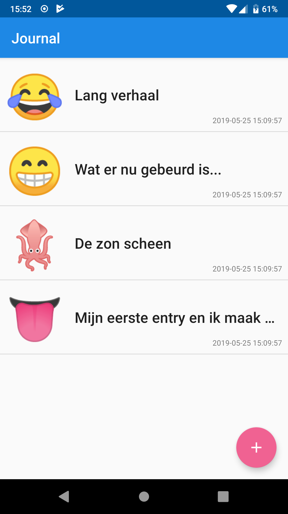
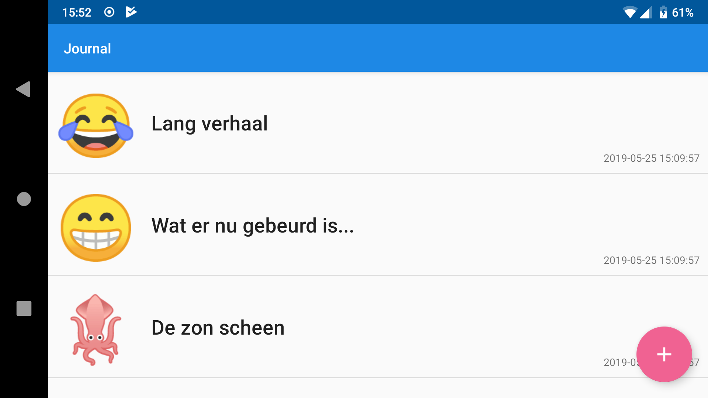
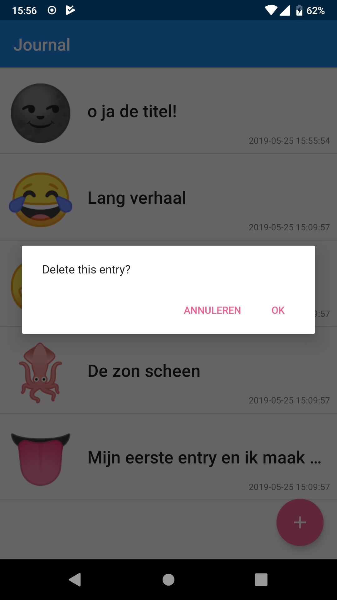
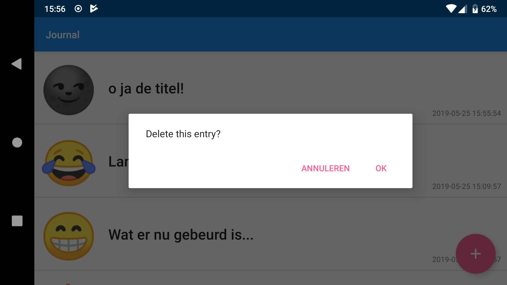

### New Entry

The user can write a title, the actual entry, and choose one of nine emoji to represent the mood for this entry.
Title and entry must be non empty and contain more than just whitespace. Titles cannot be longer than 64 characters.
A toast message informs the user if title or entry do not adhere to these requirements.

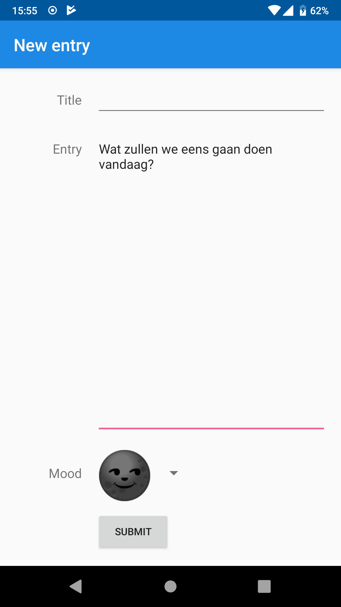
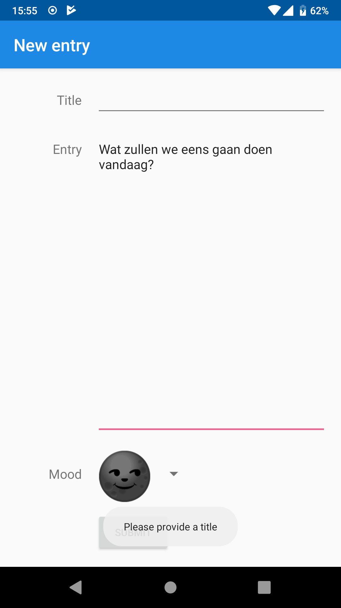
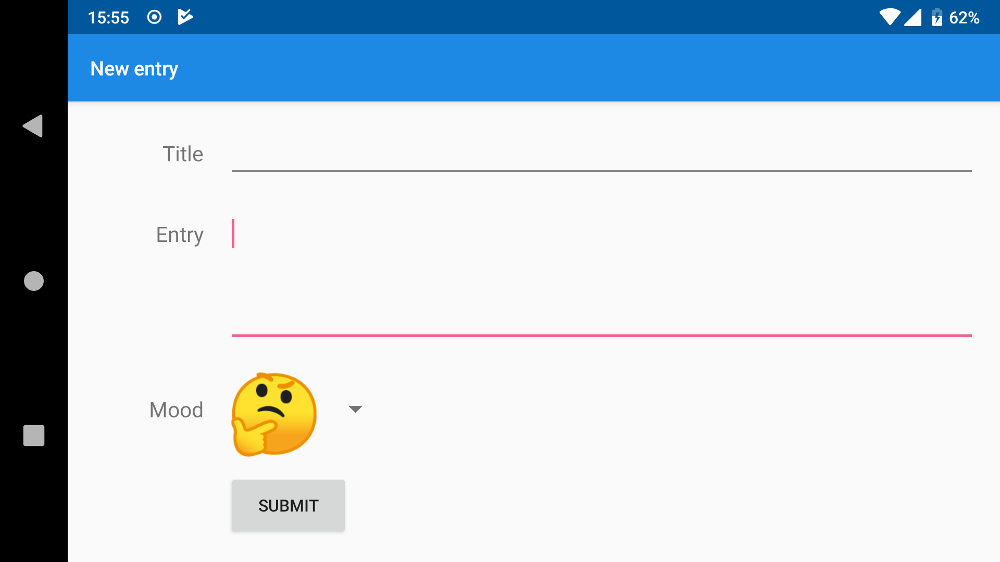
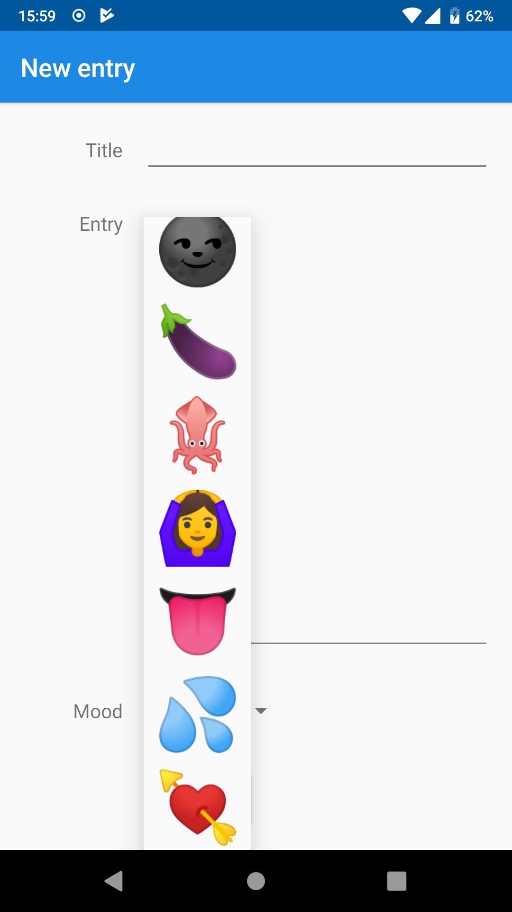

### Detail view

The detailed view of an entry contains a title, some text, a timestamp, and the mood the user chose for this entry.
The timestamp is automatically added to a new entry upon submitting, and shows the time of creation in the local timezone of creation.
If the entry is long, the user can scroll through it.

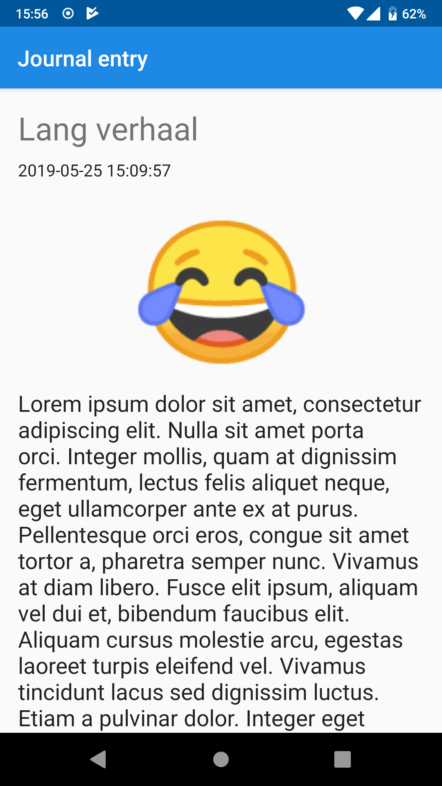
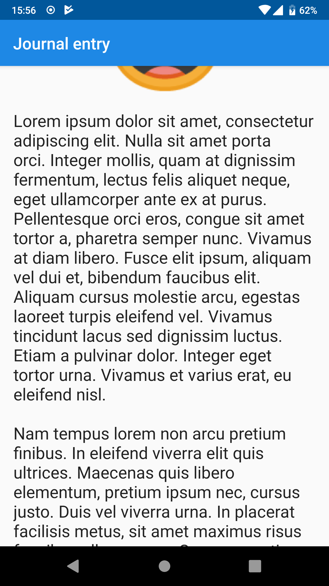
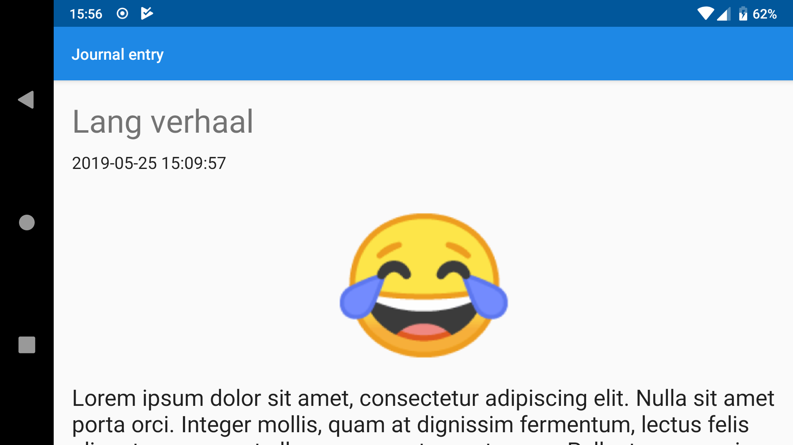
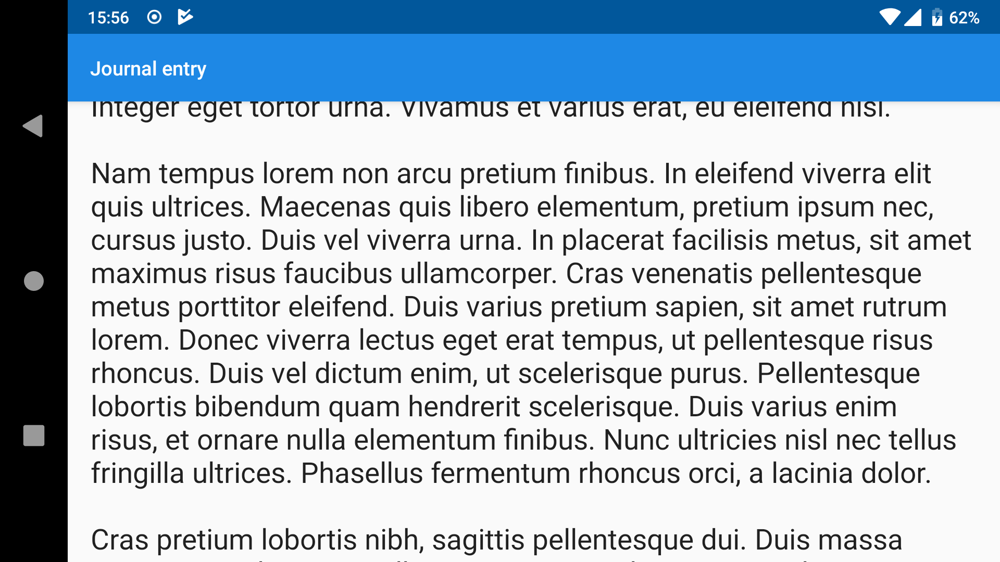

